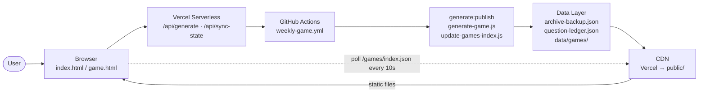
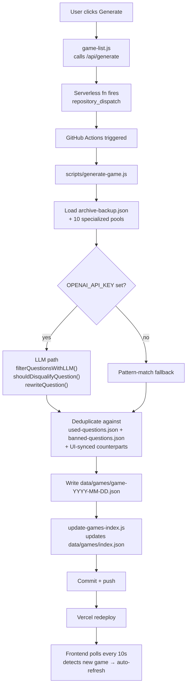
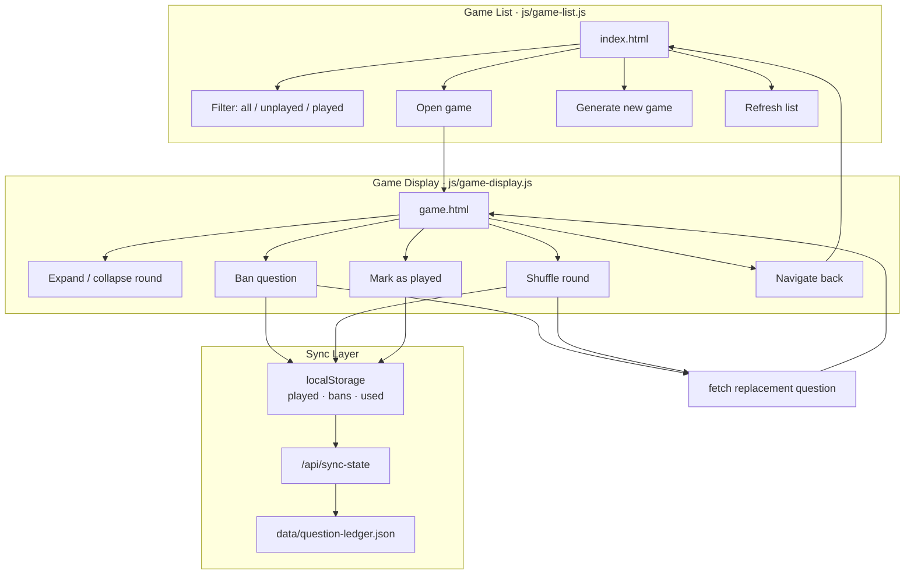
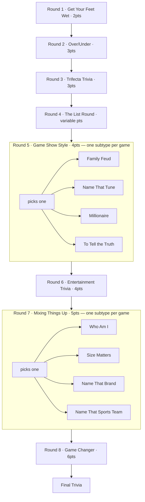
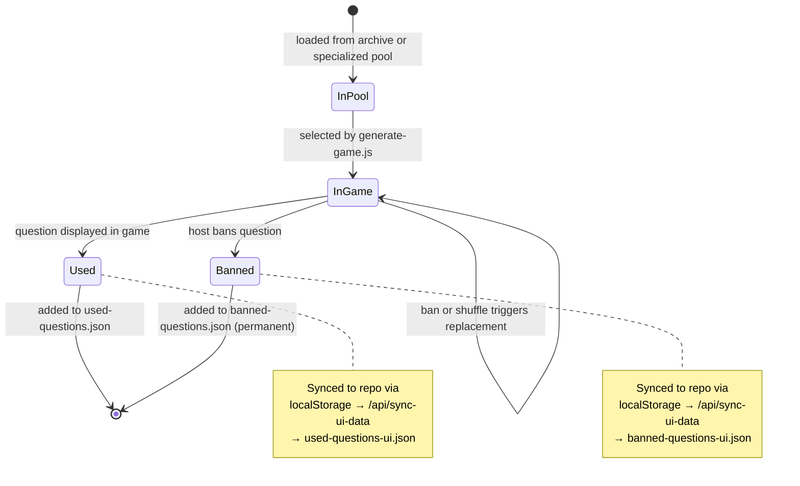

# TriviaBot — Code Map

A progressive-disclosure reference for navigating and onboarding to this codebase.
Diagrams go from macro (system) to micro (question lifecycle).

---

## 1. System Overview

All major components and data flow at a glance.

---

## 2a. Game Generation Pipeline

From "Generate" click to playable game.

---

## 2b. User Interaction Map

All user actions across both pages, and how state is synced.

---

## 3a. Round Architecture

All 8 rounds + Final Trivia.

| # | Name | Points | Source | Notes |
|---|------|--------|--------|-------|
| 1 | Get Your Feet Wet | 2 | Archive | Easy questions to ease in |
| 2 | Over / Under | 3 | LLM-generated (`over-under-questions.json`) | Numeric guessing |
| 3 | Trifecta Trivia | 3 | Archive | Easy; first "trivia in earnest" round |
| 4 | The List Round | variable | `list-round-questions.json` | Single multi-answer question; 1 pt per answer |
| 5 | Game Show Style | 4 | LLM + specialized pools | Subtypes: Family Feud · Name That Tune · Millionaire · To Tell the Truth |
| 6 | Entertainment Trivia | 4 | Archive | Movies / TV / music / books |
| 7 | Mixing Things Up | 5 | LLM + specialized pools | Subtypes: Who Am I · Size Matters · Name That Brand · Name That Sports Team |
| 8 | Game Changer | 6 | Archive | Medium difficulty |
| F | Final Trivia | — | Archive | — |

---

## 3b. Question Lifecycle

How a question moves from source data to played (or banned).

---

## Critical Files

| File | Role |
|------|------|
| `js/game-list.js` | Generate trigger, filtering, 10s polling |
| `js/game-display.js` | Round rendering, ban/shuffle, played tracking |
| `scripts/generate-game.js` | Full pipeline: `ROUND_TEMPLATES`, LLM functions, dedup; injects few-shot exemplars into rounds 2/5/7 |
| `scripts/update-games-index.js` | Maintains `data/games/index.json` |
| `scripts/lib/round-subtypes.js` | Single source of truth for round 5/7 subtypes + `matchSubType()` (shared by generation + ingest) |
| `scripts/lib/few-shot-examples.js` | Loads `data/llm-train/*.jsonl` and builds few-shot prompt blocks (closes the ingest→generate loop) |
| `scripts/lib/question-quality.js` | Machine-applied trivia-quality rules: `QUALITY_SYSTEM_RULES` (appended to the LLM system prompt) + `verifyGeneratedQuestions()`, an opt-in detector pass gated by `VERIFY_LLM_QUESTIONS=1`. Condensed counterpart of the `trivia-question-quality` skill |
| `scripts/eval-question-quality.js` | A/B quality eval for LLM rounds 2/5/7: generates each twice (rules off = baseline vs on = treatment), grades with an LLM judge (blind-solve + checklist score) and emits a blind human-review sheet. Dry-run by default; `--run` spends API. `npm run eval-questions` |
| `scripts/ingest-llm-rounds-from-examples.js` | Markdown-AST parse of `example games/` → SQLite `data/llm-rounds.db` (gitignored intermediate) |
| `scripts/export-llm-rounds-jsonl.js` | Exports SQLite → committed `data/llm-train/round{2,5,7}.jsonl` (regen: `npm run refresh-llm-train`) |
| `api/trigger-workflow.js` | Serverless: fires GitHub Actions workflow dispatch |
| `api/trigger-deploy.js` | Serverless: manual deploy trigger |
| `api/sync-ui-data.js` | Serverless: persists ban/used state from webapp |
| `data/games/index.json` | Game index consumed by frontend |
| `.github/workflows/weekly-game.yml` | Scheduled weekly game generation |
| `.github/workflows/deploy.yml` | Vercel deploy automation |
| `.github/workflows/test.yml` | CI test runner |

---

## Specialized Data Pools

Ten JSON files under `data/` feed the non-archive rounds:

| File | Used by round |
|------|--------------|
| `over-under-questions.json` | Round 2 |
| `list-round-questions.json` | Round 4 |
| `family-feud-questions.json` | Round 5 |
| `name-that-tune-questions.json` | Round 5 |
| `millionaire-questions.json` | Round 5 |
| `to-tell-the-truth-questions.json` | Round 5 |
| `who-am-i-questions.json` | Round 7 |
| `size-matters-questions.json` | Round 7 |
| `name-that-brand-questions.json` | Round 7 |
| `name-that-sports-team-questions.json` | Round 7 |
